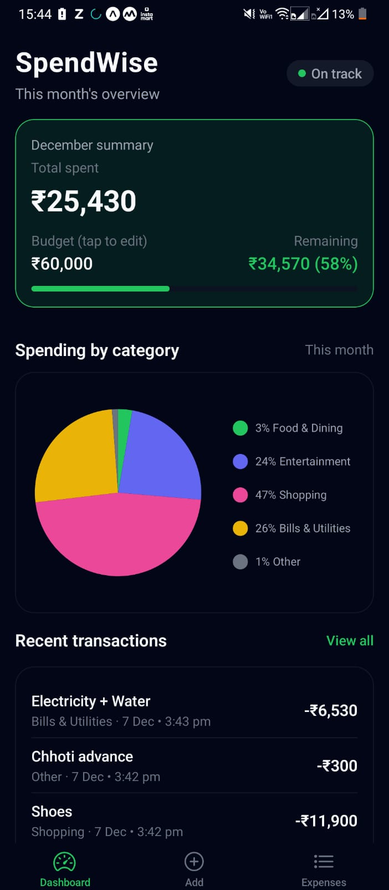
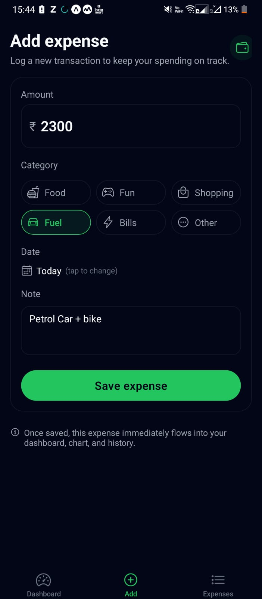
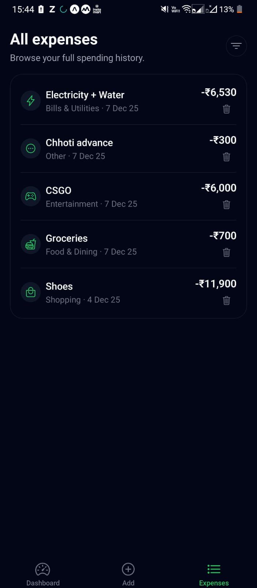

# SpendWise – React Native Expense Tracker

SpendWise is a minimal but polished personal expense tracking app built with **React Native + Expo**.  
It focuses on a clean dark UI, simple interactions, and a realistic architecture: global state with context, local persistence, and basic data visualization.

**Web version:** https://spendwiseclick.netlify.app/

[](https://spendwiseclick.netlify.app/
)

---

<p align="center">
  
  
  
</p>

---

##  Features

- **Dashboard overview**
  - Monthly total spent vs a configurable monthly budget
  - Remaining amount + progress bar
  - Category-wise spending pie chart (Food, Entertainment, Shopping, Fuel, Bills, Other)
  - Recent transactions list with a **“View all”** shortcut to full history

- **Add expense**
  - Amount input with validation
  - Category selection with icons (Food, Fun, Shopping, Fuel, Bills, Other)
  - Optional note (e.g. “Zomato dinner”, “Airport cab”)
  - Dark-themed, centered **date picker modal**
  - Saves to global state and persists to device storage

- **Expenses history**
  - Full list of all expenses with:
    - Category icon
    - Note / category label
    - Date and amount
  - **Delete** action with confirmation dialog
  - Deleting updates dashboard summary, chart, and storage

- **Budget management**
  - Monthly budget stored in global state
  - Tappable budget area on Dashboard:
    - Opens a bottom-sheet style budget editor
    - Validates input
    - Persists the new budget between app launches

- **Persistence**
  - All expenses and budget stored using AsyncStorage
  - On app restart, data is loaded and UI is rebuilt from persisted state

---

##  Tech Stack

- **Runtime & tooling**
  - [Expo](https://expo.dev/) (with Expo Router)
  - React Native
  - TypeScript

- **Navigation**
  - Expo Router tabs & stack (`app/` directory-based routing)

- **State & data**
  - React Context (`ExpensesContext`) for global state
  - AsyncStorage (`@react-native-async-storage/async-storage`) for persistence

- **UI & theming**
  - Custom dark theme via `src/theme/colors.ts` and `src/theme/spacing.ts`
  - Reusable components: `Screen`, `Card`, `PrimaryButton`, `CategoryPieChart`
  - Icons via `@expo/vector-icons/Ionicons`

- **Visualization & inputs**
  - `react-native-chart-kit` + `react-native-svg` for the category pie chart
  - `@react-native-community/datetimepicker` for date selection

---

##  Project Structure

```text
SpendWise/
  app/
    _layout.tsx              # Root layout – wraps app in ExpensesProvider, sets up Stack
    (tabs)/
      _layout.tsx            # Tab navigator: Dashboard, Add, Expenses
      index.tsx              # Dashboard screen
      add.tsx                # Add Expense screen
      explore.tsx            # Expenses list (history) screen

  src/
    components/
      Screen.tsx             # Safe-area + background + padding wrapper
      Card.tsx               # Themed card component
      PrimaryButton.tsx      # Rounded primary CTA button
      CategoryPieChart.tsx   # Pie chart wrapper, themed for SpendWise

    context/
      ExpensesContext.tsx    # Global state: expenses, budget, CRUD ops, persistence

    theme/
      colors.ts              # Dark theme color palette
      spacing.ts             # Spacing scale used across the app

    types/
      expense.ts             # Expense and ExpenseCategory TypeScript types

  package.json
  tsconfig.json
  app.json
  eas.json (optional, for EAS builds)
```
## Architecture & Data Flow

### Global state – ExpensesContext
- **The Expenses Context provides:**
  - expenses: Expense[]
  - budget: number
  - addExpense(input)
  - deleteExpense(id)
  - updateBudget(value)
  - isHydrated: boolean (whether persisted data has been loaded)

### Persistence:
- **On mount, it loads:**
  - Expenses from @spendwise/expenses

  - Budget from @spendwise/budget
  - using AsyncStorage.multiGet.
  - When expenses or budget change and isHydrated is true:
    - It serializes them to JSON and stores them back in AsyncStorage.
  - All screens subscribe via useExpenses() so they always reflect the latest state.

### Dashboard – app/(tabs)/index.tsx
- Reads expenses and budget from context.
- Filters expenses to the current month.
- Computes:
  - totalSpent for the month
  - Per-category totals → categorySlices array for the pie chart
  - remaining and remainingPct for the progress bar
  - recentTransactions (latest 3 expenses sorted by createdAt)
- Renders:
  - Summary card with totals, budget, remaining, and bar
  - Pie chart via CategoryPieChart
  - Recent transactions with a “View all” link to the Expenses tab
- Budget editing:
  - “Budget (tap to edit)” opens a bottom-sheet modal
  - User edits the budget, which calls updateBudget and persists to storage

### Add Expense – app/(tabs)/add.tsx
- Local state for:
  - amount, category, note, selectedDate
- Date picker:
  - Tapping the Date row opens a dark-themed centered modal
  - Uses @react-native-community/datetimepicker
  - Selected date is converted into an ISO yyyy-mm-dd string
- On submit:
  - Validates amount > 0
  - Calls addExpense({ amount, category, note, date: dateISO })
  - Resets local form state

### Expenses History – app/(tabs)/explore.tsx
- Reads expenses from context, sorts them by date.
- Displays:
  - Category icon
  - Note or category label
  - Date & amount
- Delete:
  - Trash icon shows confirmation Alert
  - Confirming calls deleteExpense(id), updating context and storage
  - Dashboard, chart, and history update automatically

## Getting Started (Development)
### Prerequisites
- Node.js (LTS recommended)
- npm or yarn
- Expo CLI (optional – can use npx instead)
- iOS Simulator / Android Emulator / or a physical device with Expo Go

### Install dependencies
```bash
npm install
# or
yarn install
```
### Run the app in development
```bash
npm start
# or
npx expo start
```
### Then choose:
- Press i for iOS simulator (macOS only)
- Press a for Android emulator
- Press w for Web browser
- Or scan the QR code with Expo Go on your phone

## Building & Deployment (Expo / EAS)
  1. Run:
   ```bash
   npx expo start
   ```
   Or
   ```bash
   npx expo start --web
   ``` 
  2. Scan the QR code with Expo Go on your physical device.

## Possible Improvements
- Edit expense:
  Currently only add + delete are supported. A natural next step is an Edit flow reusing the Add Expense form with pre-filled values.
- Better validation & error states:
  For a production app, amount validation, numeric formatting, and error feedback could be more robust.
- Testing & separation of logic:
  Some of the dashboard aggregation logic could be extracted into pure utility functions or custom hooks to make them easier to test in isolation.
- More filters & analytics:
  Date range filters, category filters on the history screen, and additional charts/statistics would make the app more powerful for users.

## Scripts
- **Common scripts in package.json:**
  - ```npm start``` – Start Expo dev server
  - ```npm run android``` – Run on Android emulator/device
  - ```npm run ios``` – Run on iOS simulator (macOS only)
  - ```npm run web``` – Run as a web app in the browser

## Summary
- **SpendWise demonstrates:**
  - A clean, theme-driven React Native UI
  - Proper separation of concerns:
  - navigation (app),
  - UI components (src/components),
  - state/persistence (src/context),
  - domain types (src/types)

- **Real-world features:**
  - expense CRUD,
  - budget management,
  - persistent storage,
  - data-driven dashboard with chart and history

---

<p align="center">
 ENJOY
</p>

